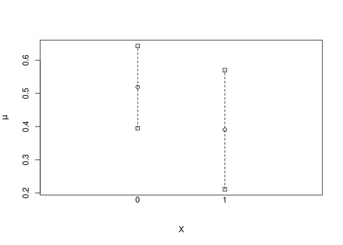

<!-- README.md is generated from README.Rmd. Please edit that file -->

# stdReg2: Regression Standardization for Causal Inference

<!-- badges: start -->

<!-- badges: end -->

Goals: create a unified interface for regression standardization to
obtain estimates of causal effects such as the average treatment effect,
or relative treatment effect.

1.  Should be easy to use for applied practitioners, i.e., as easy as
    running glm or coxph.
2.  We want to implement modern, theoretically grounded, doubly-robust
    estimators, and their associated variance estimators.
3.  We want it to be extensible for statistical researchers, i.e.,
    possible to implement new estimators and get other models used
    within the interface.
4.  Robust and clear documentation with lots of examples and explanation
    of the necessary assumptions.

## Difference between `stdReg2` and `stdReg`

`stdReg2` is the next generation of `stdReg`. If you are happy using
`stdReg`, you can continue using it and nothing will change in the near
future. With `stdReg2` we aim to solve similar problems but with nicer
output, more available methods, the possibility to include new methods,
and mainly to make maintenance and updating easier.

## Installation

`stdReg2` is available on CRAN and can be installed with:

``` r
install.packages("stdReg2")
```

You can install the development version of `stdReg2` from
[GitHub](https://github.com/) with:

``` r
# install.packages("remotes")
# remotes::install_github("sachsmc/stdReg2")
```

## Example

This is a basic example which shows you how to use regression
standardization in a logistic regression model to obtain estimates of
the causal risk difference and causal risk ratio:

``` r
library(stdReg2)

# basic example
# need to correctly specify the outcome model and no unmeasured confounders
# (+ standard causal assumptions)
set.seed(6)
n <- 100
Z <- rnorm(n)
X <- rnorm(n, mean = Z)
Y <- rbinom(n, 1, prob = (1 + exp(X + Z))^(-1))
dd <- data.frame(Z, X, Y)
x <- standardize_glm(
 formula = Y ~ X * Z,
 family = "binomial",
 data = dd,
 values = list(X = 0:1),
 contrasts = c("difference", "ratio"),
 reference = 0
)
x
#> Outcome formula: Y ~ X * Z
#> Outcome family: quasibinomial 
#> Outcome link function: logit 
#> Exposure:  X 
#> 
#> Tables: 
#>   X Estimate Std.Error lower.0.95 upper.0.95
#> 1 0    0.519    0.0622      0.397      0.641
#> 2 1    0.391    0.0924      0.209      0.572
#> 
#> Reference level:  X = 0 
#> Contrast:  difference 
#>   X Estimate Std.Error lower.0.95 upper.0.95
#> 1 0    0.000    0.0000      0.000    0.00000
#> 2 1   -0.129    0.0639     -0.254   -0.00322
#> 
#> Reference level:  X = 0 
#> Contrast:  ratio 
#>   X Estimate Std.Error lower.0.95 upper.0.95
#> 1 0    1.000     0.000        1.0          1
#> 2 1    0.752     0.129        0.5          1
plot(x)
```



``` r
tidy(x)
#>   X   Estimate  Std.Error lower.0.95   upper.0.95   contrast transform
#> 1 0  0.5190639 0.06219793  0.3971582  0.640969573       none  identity
#> 2 1  0.3905311 0.09236927  0.2094907  0.571571540       none  identity
#> 3 0  0.0000000 0.00000000  0.0000000  0.000000000 difference  identity
#> 4 1 -0.1285328 0.06393487 -0.2538428 -0.003222729 difference  identity
#> 5 0  1.0000000 0.00000000  1.0000000  1.000000000      ratio  identity
#> 6 1  0.7523758 0.12876862  0.4999940  1.004757658      ratio  identity
```

For more detailed examples, see the vignette “Estimation of causal
effects using stdReg2”.

## Citation

``` r
citation("stdReg2")
#> To cite package 'stdReg2' in publications use:
#> 
#>   Sachs, C M, Ohlendorff, Sebastian J, Brand, Adam, Sj"olander, Arvid,
#>   Gabriel, E E (2025). "The next generation of regression
#>   standardization with the R package stdReg2." _Annals of
#>   Epidemiology_, *105*, 66-74. doi:10.1016/j.annepidem.2025.04.002
#>   <https://doi.org/10.1016/j.annepidem.2025.04.002>.
#> 
#> A BibTeX entry for LaTeX users is
#> 
#>   @Article{,
#>     title = {The next generation of regression standardization with the R package stdReg2},
#>     author = {{Sachs} and Michael C and {Ohlendorff} and Johan Sebastian and {Brand} and {Adam} and {Sj{"o}lander} and {Arvid} and {Gabriel} and Erin E},
#>     journal = {Annals of Epidemiology},
#>     volume = {105},
#>     pages = {66--74},
#>     year = {2025},
#>     publisher = {Elsevier},
#>     doi = {10.1016/j.annepidem.2025.04.002},
#>   }
```
