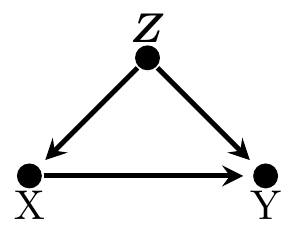
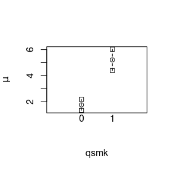
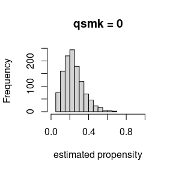
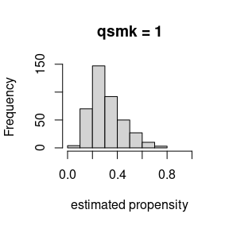

# Estimation of causal effects using stdReg2

``` r

library(stdReg2)
```

### Introduction and context

Suppose $`X`$ denotes an exposure of interest that takes values 0 or 1.
This could represent two different medical treatments, environmental
exposures, economic policies, or genetic variants. We will most often
use biomedical examples because we are biostatisticians.

We consider the setting where it is of interest to quantify the effect
of intervening with $`X`$ on outcome that we will denote $`Y`$. The
outcome could represent some numeric value, it could be the presence or
absence of a condition, or it could be the time between two events, such
as time from cancer diagnosis to death. Let $`Y(X = x)`$ denote the
potential outcome if all subjects in the population would hypothetically
be exposed to $`X = x`$.

To quantify the effect of $`X`$, we must summarize the distribution of
$`Y(X = x)`$ with some statistic. If $`Y`$ is dichotomous, it is natural
to use $`p\{Y(X = x) = 1\}`$, called the risk. If $`Y`$ is continuous,
the mean is a natural summary statistic $`E\{Y(X = x)\}`$. If $`Y`$ is a
continuous time-to-event, the probability of exceeding a particular
value $`t`$ is a reasonable statistic: $`p\{Y(X = x) > t\}`$. In
general, denote the summary statistic of choice as $`T\{Y(X = x)\}`$.
The summary statistic can also be applied to conditional distributions,
which we will denote, e.g., $`T\{Y | X = x\}`$.

To quantify the effect of $`X`$, we must also decide on a *contrast* to
measure the causal effect. The point of the contrast is to compare the
chosen summary statistic between the $`X = 1`$ and $`X = 0`$
interventions. Typical choices would be the difference
$`T\{Y(X = 1)\} - T\{Y(X = 0)\}`$ or the ratio
$`T\{Y(X = 1)\} / T\{Y(X = 0)\}`$. It may also be of interest to
quantify and report the summary statistics within each group
$`(T\{Y(X = 1)\}, T\{Y(X = 0)\})`$.

In observational studies, the relationship between $`X`$ and $`Y`$ is
likely confounded by a set of other variables $`\boldsymbol{Z}`$. This
means that the values of the outcome $`Y`$ are determined by at least a
subset of $`\boldsymbol{Z}`$ and the values of the exposure $`X`$ are
determined by a subset of $`\boldsymbol{Z}`$. Naively estimating the
contrast would lead to biased estimates of the causal effect.

### Regression standardization

See Sjölander (2016) and Sjölander (2018) for more details. Suppose that
the covariates $`\boldsymbol{Z}`$ are sufficient for confounding
control. For more information on what constitutes a sufficient
adjustment set, see Witte and Didelez (2019). For a given summary
statistic $`T`$, then
``` math
T\{Y(X = x)\} = E_{\boldsymbol{Z}}[T\{Y | X = x, \boldsymbol{Z}\}], 
```
where the expectation is taken with respect to the population
distribution of $`\boldsymbol{Z}`$. This is also known as the
*g-formula* or *adjustment formula*.

In order to estimate this quantity based on an independent and
identically distributed sample
$`(X_1, Y_1, \boldsymbol{Z}_1), \ldots, (X_n, Y_n, \boldsymbol{Z}_n)`$,
we proceed by

1.  Specifying and estimating a regression model for $`Y`$ given $`X`$
    and $`\boldsymbol{Z}`$.
2.  Use the fitted model to obtain estimates of
    $`T\{Y_i | X_i = x, \boldsymbol{Z}_i\}`$ for $`i = 1, \ldots, n`$.
    This is done by creating a copy of the observed dataset, replacing
    the observed $`X_i`$ with $`x`$ for each individual, and using the
    fitted model to get predicted values for the copy of the observed
    data. Denote these predicted values as
    $`\hat{T}\{Y_i | X_i = x, \boldsymbol{Z}_i\}`$.
3.  Average over the empirical distribution of $`\boldsymbol{Z}`$ to
    obtain the estimate
    ``` math
    \hat{T}\{Y(X = x)\} = \frac{1}{n}\sum_{i = 1}^n \hat{T}\{Y_i | X_i = x, \boldsymbol{Z}_i\}.
    ```

One can do this for each level of $`X = 0, 1`$ and compute the desired
contrast. Under the assumptions that 1) $`\boldsymbol{Z}`$ is sufficient
for confounding control, and 2) the regression model in step 1 is
correctly specified, then this estimator is consistent and
asymptotically normal.

### Improving robustness by modeling the exposure

A doubly-robust estimator is an estimator that is consistent for a given
estimand when one or more of the models used in the forming of the
estimator is correctly specified for confounding. So far, we only have
one model used in our estimator: the *outcome model*. We will now
introduce a model for the exposure, and see how we can combine them.
First, some terminology:

*Misspecified model* - The true generating mechanism is not contained in
the possible mechanisms that are possible under the selected model.

*Correctly Specified* - A model is correctly specified if it is not
misspecified.

*Correctly specified for confounding* - A correctly specified model that
contains a sufficient set of confounders.

If we can model $`P(X=1|\boldsymbol{Z})`$, and it is correctly specified
and contains all confounders, then we can use that to estimate the
probability that each individual $`i`$ received the treatment that they
did
$`W_i = \frac{X_i}{P(X_i=1|\boldsymbol{Z}_i)} + \frac{1-X_i}{1-P(X_i=1|\boldsymbol{Z}_i)}`$.
Let $`\hat{p}_i`$ denote the estimated probability that subject $`i`$
received treatment $`1`$.

Any consistent estimation method can be used for the outcome and
exposure models. As long as *either* the outcome model *or* the
propensity score model is correctly specified for confounding, then a
doubly robust estimator is consistent for the ATE. In this package, for
generalized linear models, we use the estimator as described by Gabriel
et al. (2024).

Recently, there seems to be a general misconception that combining an
adjusted outcome model and a propensity score model always gives a
doubly robust estimator. **This is not true** – it matters how you
combine them!

## In practice

Here we will use regression standardization to estimate the average
causal effect of the exposure (quitting smoking) in the variable `qsmk`
on the weight gain outcome in the variable `wt82_71` in the
`nhefs_complete` dataset that comes with the `causaldata` package. The
data was collected as part of a project by the National Center for
Health Statistics and the National Institute on Aging in collaboration
with other agencies of the United States Public Health Service. It was
designed to investigate the relationships between clinical, nutritional,
and behavioral factors and subsequent morbidity, mortality, and hospital
utilization and changes in risk factors, functional limitation, and
institutionalization. The dataset includes 1566 individuals and contains
among others the following variables:

- seqn: person id}
- wt82_71: weight gain in kilograms between 1971 and 1982
- qsmk: quit smoking between between 1st questionnaire and 1982, 1 =
  yes, 0 = no
- sex: 0 = male, 1 = female
- race: 0 = white, 1 = black or other
- age: age in years at baseline
- education: level of education in 1971, 1 = 8th grade or less, 2 = high
  school dropout, 3 = high school, 4 - dropout, 5 = college or more
- smokeintensity: number of cigarettes smoked per day in 1971
- smokeyrs: number of years smoked
- exercise: level of physical activity in 1971, 0 = much exercise, 1 =
  moderate exercise, 2 = little or no exercise
- active: level of activity in 1971, 0 = very active, 1 = moderately
  active, 2 = inactive, 3 = missing
- wt71: weight in kilograms in 1971
- ht: height in centimeters in 1971

``` r

nhefs_dat <- causaldata::nhefs_complete
summary(nhefs_dat)
#>       seqn            qsmk            death            yrdth      
#>  Min.   :  233   Min.   :0.0000   Min.   :0.0000   Min.   :83.00  
#>  1st Qu.:10625   1st Qu.:0.0000   1st Qu.:0.0000   1st Qu.:85.00  
#>  Median :20702   Median :0.0000   Median :0.0000   Median :88.00  
#>  Mean   :16639   Mean   :0.2573   Mean   :0.1858   Mean   :87.64  
#>  3rd Qu.:22771   3rd Qu.:1.0000   3rd Qu.:0.0000   3rd Qu.:90.00  
#>  Max.   :25061   Max.   :1.0000   Max.   :1.0000   Max.   :92.00  
#>                                                    NA's   :1275   
#>      modth            dadth           sbp             dbp         sex    
#>  Min.   : 1.000   Min.   : 1.0   Min.   : 87.0   Min.   : 47.00   0:762  
#>  1st Qu.: 3.000   1st Qu.: 8.0   1st Qu.:115.0   1st Qu.: 70.00   1:804  
#>  Median : 6.000   Median :16.0   Median :126.0   Median : 77.00          
#>  Mean   : 6.383   Mean   :16.1   Mean   :128.6   Mean   : 77.74          
#>  3rd Qu.:10.000   3rd Qu.:24.5   3rd Qu.:139.0   3rd Qu.: 85.00          
#>  Max.   :12.000   Max.   :31.0   Max.   :229.0   Max.   :130.00          
#>  NA's   :1271     NA's   :1271   NA's   :29      NA's   :33              
#>       age        race         income         marital          school     
#>  Min.   :25.00   0:1360   Min.   :11.00   Min.   :2.000   Min.   : 0.00  
#>  1st Qu.:33.00   1: 206   1st Qu.:17.00   1st Qu.:2.000   1st Qu.:10.00  
#>  Median :43.00            Median :19.00   Median :2.000   Median :12.00  
#>  Mean   :43.66            Mean   :17.99   Mean   :2.496   Mean   :11.17  
#>  3rd Qu.:53.00            3rd Qu.:20.00   3rd Qu.:2.000   3rd Qu.:12.00  
#>  Max.   :74.00            Max.   :22.00   Max.   :8.000   Max.   :17.00  
#>                           NA's   :59                                     
#>  education       ht             wt71             wt82           wt82_71       
#>  1:291     Min.   :142.9   Min.   : 39.58   Min.   : 35.38   Min.   :-41.280  
#>  2:340     1st Qu.:161.8   1st Qu.: 59.53   1st Qu.: 61.69   1st Qu.: -1.478  
#>  3:637     Median :168.2   Median : 69.23   Median : 72.12   Median :  2.604  
#>  4:121     Mean   :168.7   Mean   : 70.83   Mean   : 73.47   Mean   :  2.638  
#>  5:177     3rd Qu.:175.3   3rd Qu.: 79.80   3rd Qu.: 83.46   3rd Qu.:  6.690  
#>            Max.   :198.1   Max.   :151.73   Max.   :136.53   Max.   : 48.538  
#>                                                                               
#>    birthplace    smokeintensity  smkintensity82_71    smokeyrs    
#>  Min.   : 1.00   Min.   : 1.00   Min.   :-80.000   Min.   : 1.00  
#>  1st Qu.:22.00   1st Qu.:10.00   1st Qu.:-10.000   1st Qu.:15.00  
#>  Median :34.00   Median :20.00   Median : -1.000   Median :24.00  
#>  Mean   :31.67   Mean   :20.53   Mean   : -4.633   Mean   :24.59  
#>  3rd Qu.:42.00   3rd Qu.:30.00   3rd Qu.:  1.000   3rd Qu.:33.00  
#>  Max.   :56.00   Max.   :80.00   Max.   : 50.000   Max.   :64.00  
#>  NA's   :90                                                       
#>      asthma            bronch              tb                hf          
#>  Min.   :0.00000   Min.   :0.00000   Min.   :0.00000   Min.   :0.000000  
#>  1st Qu.:0.00000   1st Qu.:0.00000   1st Qu.:0.00000   1st Qu.:0.000000  
#>  Median :0.00000   Median :0.00000   Median :0.00000   Median :0.000000  
#>  Mean   :0.04853   Mean   :0.08365   Mean   :0.01341   Mean   :0.005109  
#>  3rd Qu.:0.00000   3rd Qu.:0.00000   3rd Qu.:0.00000   3rd Qu.:0.000000  
#>  Max.   :1.00000   Max.   :1.00000   Max.   :1.00000   Max.   :1.000000  
#>                                                                          
#>       hbp         pepticulcer        colitis          hepatitis      
#>  Min.   :0.000   Min.   :0.0000   Min.   :0.00000   Min.   :0.00000  
#>  1st Qu.:0.000   1st Qu.:0.0000   1st Qu.:0.00000   1st Qu.:0.00000  
#>  Median :1.000   Median :0.0000   Median :0.00000   Median :0.00000  
#>  Mean   :1.059   Mean   :0.1015   Mean   :0.03448   Mean   :0.01788  
#>  3rd Qu.:2.000   3rd Qu.:0.0000   3rd Qu.:0.00000   3rd Qu.:0.00000  
#>  Max.   :2.000   Max.   :1.0000   Max.   :1.00000   Max.   :1.00000  
#>                                                                      
#>   chroniccough        hayfever          diabetes          polio        
#>  Min.   :0.00000   Min.   :0.00000   Min.   :0.0000   Min.   :0.00000  
#>  1st Qu.:0.00000   1st Qu.:0.00000   1st Qu.:0.0000   1st Qu.:0.00000  
#>  Median :0.00000   Median :0.00000   Median :0.0000   Median :0.00000  
#>  Mean   :0.05109   Mean   :0.08621   Mean   :0.9898   Mean   :0.01405  
#>  3rd Qu.:0.00000   3rd Qu.:0.00000   3rd Qu.:2.0000   3rd Qu.:0.00000  
#>  Max.   :1.00000   Max.   :1.00000   Max.   :2.0000   Max.   :1.00000  
#>                                                                        
#>      tumor          nervousbreak       alcoholpy       alcoholfreq   
#>  Min.   :0.00000   Min.   :0.00000   Min.   :0.0000   Min.   :0.000  
#>  1st Qu.:0.00000   1st Qu.:0.00000   1st Qu.:1.0000   1st Qu.:1.000  
#>  Median :0.00000   Median :0.00000   Median :1.0000   Median :2.000  
#>  Mean   :0.02363   Mean   :0.02746   Mean   :0.8787   Mean   :1.913  
#>  3rd Qu.:0.00000   3rd Qu.:0.00000   3rd Qu.:1.0000   3rd Qu.:3.000  
#>  Max.   :1.00000   Max.   :1.00000   Max.   :2.0000   Max.   :5.000  
#>                                                                      
#>   alcoholtype    alcoholhowmuch        pica          headache     
#>  Min.   :1.000   Min.   : 1.000   Min.   :0.000   Min.   :0.0000  
#>  1st Qu.:1.000   1st Qu.: 2.000   1st Qu.:0.000   1st Qu.:0.0000  
#>  Median :3.000   Median : 2.000   Median :0.000   Median :1.0000  
#>  Mean   :2.466   Mean   : 3.293   Mean   :0.986   Mean   :0.6328  
#>  3rd Qu.:4.000   3rd Qu.: 4.000   3rd Qu.:2.000   3rd Qu.:1.0000  
#>  Max.   :4.000   Max.   :48.000   Max.   :2.000   Max.   :1.0000  
#>                  NA's   :397                                      
#>    otherpain        weakheart         allergies           nerves     
#>  Min.   :0.0000   Min.   :0.00000   Min.   :0.00000   Min.   :0.000  
#>  1st Qu.:0.0000   1st Qu.:0.00000   1st Qu.:0.00000   1st Qu.:0.000  
#>  Median :0.0000   Median :0.00000   Median :0.00000   Median :0.000  
#>  Mean   :0.2433   Mean   :0.02235   Mean   :0.06322   Mean   :0.145  
#>  3rd Qu.:0.0000   3rd Qu.:0.00000   3rd Qu.:0.00000   3rd Qu.:0.000  
#>  Max.   :1.0000   Max.   :1.00000   Max.   :1.00000   Max.   :1.000  
#>                                                                      
#>     lackpep            hbpmed       boweltrouble       wtloss       
#>  Min.   :0.00000   Min.   :0.000   Min.   :0.000   Min.   :0.00000  
#>  1st Qu.:0.00000   1st Qu.:0.000   1st Qu.:0.000   1st Qu.:0.00000  
#>  Median :0.00000   Median :1.000   Median :1.000   Median :0.00000  
#>  Mean   :0.05045   Mean   :1.015   Mean   :1.046   Mean   :0.02618  
#>  3rd Qu.:0.00000   3rd Qu.:2.000   3rd Qu.:2.000   3rd Qu.:0.00000  
#>  Max.   :1.00000   Max.   :2.000   Max.   :2.000   Max.   :1.00000  
#>                                                                     
#>    infection     active  exercise  birthcontrol    pregnancies    
#>  Min.   :0.000   0:702   0:300    Min.   :0.000   Min.   : 1.000  
#>  1st Qu.:0.000   1:715   1:661    1st Qu.:0.000   1st Qu.: 2.000  
#>  Median :0.000   2:149   2:605    Median :1.000   Median : 3.000  
#>  Mean   :0.145                    Mean   :1.081   Mean   : 3.694  
#>  3rd Qu.:0.000                    3rd Qu.:2.000   3rd Qu.: 5.000  
#>  Max.   :1.000                    Max.   :2.000   Max.   :15.000  
#>                                                   NA's   :866     
#>   cholesterol      hightax82         price71         price82     
#>  Min.   : 78.0   Min.   :0.0000   Min.   :1.507   Min.   :1.452  
#>  1st Qu.:189.0   1st Qu.:0.0000   1st Qu.:2.037   1st Qu.:1.740  
#>  Median :216.0   Median :0.0000   Median :2.168   Median :1.815  
#>  Mean   :219.9   Mean   :0.1653   Mean   :2.138   Mean   :1.806  
#>  3rd Qu.:245.0   3rd Qu.:0.0000   3rd Qu.:2.242   3rd Qu.:1.868  
#>  Max.   :416.0   Max.   :1.0000   Max.   :2.693   Max.   :2.103  
#>  NA's   :16      NA's   :90       NA's   :90      NA's   :90     
#>      tax71            tax82          price71_82         tax71_82      
#>  Min.   :0.5249   Min.   :0.2200   Min.   :-0.2027   Min.   :0.03599  
#>  1st Qu.:0.9449   1st Qu.:0.4399   1st Qu.: 0.2010   1st Qu.:0.46100  
#>  Median :1.0498   Median :0.5060   Median : 0.3360   Median :0.54395  
#>  Mean   :1.0580   Mean   :0.5058   Mean   : 0.3324   Mean   :0.55220  
#>  3rd Qu.:1.1548   3rd Qu.:0.5719   3rd Qu.: 0.4438   3rd Qu.:0.62195  
#>  Max.   :1.5225   Max.   :0.7479   Max.   : 0.6121   Max.   :0.88440  
#>  NA's   :90       NA's   :90       NA's   :90        NA's   :90       
#>        id            censored     older       
#>  Min.   :   1.0   Min.   :0   Min.   :0.0000  
#>  1st Qu.: 414.2   1st Qu.:0   1st Qu.:0.0000  
#>  Median : 824.5   Median :0   Median :0.0000  
#>  Mean   : 821.0   Mean   :0   Mean   :0.2989  
#>  3rd Qu.:1228.8   3rd Qu.:0   3rd Qu.:1.0000  
#>  Max.   :1629.0   Max.   :0   Max.   :1.0000  
#> 
```

We will assume that the set of confounders in $`\boldsymbol{Z}`$
includes sex, race, age, education, number of cigarettes smoked per
year, the number of years smoked, level of physical activity, and
baseline weight in 1971. This equivalent to assuming that the
counterfactual weight gain is independent of the exposure conditional on
these variables. In other words, we are assuming the following directed
acyclic graph:



For the specific forms of the conditional expectations required in the
outcome we assume a linear regression model with both linear and
quadratic forms of the continuous covariates. We can fit this as

``` r

m <- glm(wt82_71 ~ qsmk + sex + race + age + I(age^2) + 
        as.factor(education) + smokeintensity + I(smokeintensity^2) + 
        smokeyrs + I(smokeyrs^2) + as.factor(exercise) + as.factor(active) +
          wt71 + I(wt71^2), 
        data = nhefs_dat)
summary(m)
#> 
#> Call:
#> glm(formula = wt82_71 ~ qsmk + sex + race + age + I(age^2) + 
#>     as.factor(education) + smokeintensity + I(smokeintensity^2) + 
#>     smokeyrs + I(smokeyrs^2) + as.factor(exercise) + as.factor(active) + 
#>     wt71 + I(wt71^2), data = nhefs_dat)
#> 
#> Coefficients:
#>                         Estimate Std. Error t value Pr(>|t|)    
#> (Intercept)           -1.6586176  4.3137734  -0.384 0.700666    
#> qsmk                   3.4626218  0.4384543   7.897 5.36e-15 ***
#> sex1                  -1.4650496  0.4683410  -3.128 0.001792 ** 
#> race1                  0.5864117  0.5816949   1.008 0.313560    
#> age                    0.3626624  0.1633431   2.220 0.026546 *  
#> I(age^2)              -0.0061377  0.0017263  -3.555 0.000389 ***
#> as.factor(education)2  0.8185263  0.6067815   1.349 0.177546    
#> as.factor(education)3  0.5715004  0.5561211   1.028 0.304273    
#> as.factor(education)4  1.5085173  0.8323778   1.812 0.070134 .  
#> as.factor(education)5 -0.1708264  0.7413289  -0.230 0.817786    
#> smokeintensity         0.0651533  0.0503115   1.295 0.195514    
#> I(smokeintensity^2)   -0.0010468  0.0009373  -1.117 0.264261    
#> smokeyrs               0.1333931  0.0917319   1.454 0.146104    
#> I(smokeyrs^2)         -0.0018270  0.0015438  -1.183 0.236818    
#> as.factor(exercise)1   0.3206824  0.5349616   0.599 0.548961    
#> as.factor(exercise)2   0.3628786  0.5589557   0.649 0.516300    
#> as.factor(active)1    -0.9429574  0.4100208  -2.300 0.021593 *  
#> as.factor(active)2    -0.2580374  0.6847219  -0.377 0.706337    
#> wt71                   0.0373642  0.0831658   0.449 0.653297    
#> I(wt71^2)             -0.0009158  0.0005235  -1.749 0.080426 .  
#> ---
#> Signif. codes:  0 '***' 0.001 '**' 0.01 '*' 0.05 '.' 0.1 ' ' 1
#> 
#> (Dispersion parameter for gaussian family taken to be 53.59474)
#> 
#>     Null deviance: 97176  on 1565  degrees of freedom
#> Residual deviance: 82857  on 1546  degrees of freedom
#> AIC: 10701
#> 
#> Number of Fisher Scoring iterations: 2
```

To perform regression standardization to estimate the causal effect we
use `standardize_glm`. We must specify the same outcome regression model
as a formula, provide the data, describe which values of the exposure we
wish to estimate the counterfactual means, specify which contrasts we
want, and specify the reference level for the contrasts. The following
command estimates that model and we obtain the group-wise estimates, the
difference, and the ratio.

``` r

m2 <- standardize_glm(wt82_71 ~ qsmk + sex + race + age + I(age^2) + 
               as.factor(education) + smokeintensity + I(smokeintensity^2) + 
               smokeyrs + I(smokeyrs^2) + as.factor(exercise) + as.factor(active) +
               wt71 + I(wt71^2), 
            data = nhefs_dat, 
            values = list(qsmk = c(0,1)),
            contrasts = c("difference", "ratio"),
            reference = 0)

m2
#> Outcome formula: wt82_71 ~ qsmk + sex + race + age + I(age^2) + as.factor(education) + 
#>     smokeintensity + I(smokeintensity^2) + smokeyrs + I(smokeyrs^2) + 
#>     as.factor(exercise) + as.factor(active) + wt71 + I(wt71^2)
#> Outcome family: gaussian 
#> Outcome link function: identity 
#> Exposure:  qsmk 
#> 
#> Tables: 
#>   qsmk Estimate Std.Error lower.0.95 upper.0.95
#> 1    0     1.75     0.218       1.32       2.17
#> 2    1     5.21     0.419       4.39       6.03
#> 
#> Reference level:  qsmk = 0 
#> Contrast:  difference 
#>   qsmk Estimate Std.Error lower.0.95 upper.0.95
#> 1    0     0.00     0.000       0.00       0.00
#> 2    1     3.46     0.466       2.55       4.38
#> 
#> Reference level:  qsmk = 0 
#> Contrast:  ratio 
#>   qsmk Estimate Std.Error lower.0.95 upper.0.95
#> 1    0     1.00     0.000       1.00       1.00
#> 2    1     2.98     0.436       2.13       3.84

plot(m2)
```



``` r

plot(m2, contrast = "difference", reference = 0)
```


The output from the model shows the estimated potential outcome means in
each exposure level, the difference and ratio thereof, and the
associated standard error estimates, confidence intervals, and p-values.
Inference is done using the sandwich method for variance calculation.
Under the assumptions that the outcome model is correctly specified and
contains all confounders, these are consistent estimates of the causal
effects of interest. We can also get plots of the effects by using the
plot function.

To obtain the estimates and inference for the different contrasts as a
tidy data frame, suitable for saving as a data table or using in
downstream analyses or reports, we provide the `tidy` function:

``` r

(tidy(m2) -> tidy_m2) |> print()
#>   qsmk Estimate Std.Error lower.0.95 upper.0.95   contrast transform
#> 1    0 1.747216 0.2179825   1.319979   2.174454       none  identity
#> 2    1 5.209838 0.4190740   4.388468   6.031208       none  identity
#> 3    0 0.000000 0.0000000   0.000000   0.000000 difference  identity
#> 4    1 3.462622 0.4660848   2.549112   4.376131 difference  identity
#> 5    0 1.000000 0.0000000   1.000000   1.000000      ratio  identity
#> 6    1 2.981793 0.4360644   2.127123   3.836464      ratio  identity
```

To obtain doubly robust inference we use the following command. Note
that we now specify a model for the exposure, the propensity score
model.

``` r

m2_dr <- standardize_glm_dr(formula_outcome = wt82_71 ~ qsmk + sex + race + age + I(age^2) + 
               as.factor(education) + smokeintensity + I(smokeintensity^2) + 
               smokeyrs + I(smokeyrs^2) + as.factor(exercise) + as.factor(active) +
               wt71 + I(wt71^2), 
               formula_exposure = qsmk ~ sex + race + age + I(age^2) +
                as.factor(education) + smokeintensity + I(smokeintensity^2) + 
                smokeyrs + I(smokeyrs^2) + as.factor(exercise) + as.factor(active) + 
                wt71 + I(wt71^2),
            data = nhefs_dat, 
            values = list(qsmk = c(0,1)),
            contrast = c("difference", "ratio"),
            reference = 0) 

m2_dr
#> Doubly robust estimator with: 
#> 
#> Exposure formula: qsmk ~ sex + race + age + I(age^2) + as.factor(education) + smokeintensity + 
#>     I(smokeintensity^2) + smokeyrs + I(smokeyrs^2) + as.factor(exercise) + 
#>     as.factor(active) + wt71 + I(wt71^2)
#> Exposure link function: logit 
#> Outcome formula: wt82_71 ~ qsmk + sex + race + age + I(age^2) + as.factor(education) + 
#>     smokeintensity + I(smokeintensity^2) + smokeyrs + I(smokeyrs^2) + 
#>     as.factor(exercise) + as.factor(active) + wt71 + I(wt71^2)
#> Outcome family: gaussian 
#> Outcome link function: identity 
#> Exposure:  qsmk 
#> 
#> Tables: 
#>   qsmk Estimate Std.Error lower.0.95 upper.0.95
#> 1    0     1.76     0.218       1.34       2.19
#> 2    1     5.19     0.438       4.33       6.04
#> 
#> Reference level:  qsmk = 0 
#> Contrast:  difference 
#>   qsmk Estimate Std.Error lower.0.95 upper.0.95
#> 1    0     0.00      0.00       0.00       0.00
#> 2    1     3.42      0.48       2.48       4.37
#> 
#> Reference level:  qsmk = 0 
#> Contrast:  ratio 
#>   qsmk Estimate Std.Error lower.0.95 upper.0.95
#> 1    0     1.00     0.000        1.0       1.00
#> 2    1     2.94     0.431        2.1       3.79

(tidy(m2_dr) -> tidy_m2_dr) |> print()
#>   qsmk Estimate Std.Error lower.0.95 upper.0.95   contrast transform
#> 1    0 1.762981 0.2176810   1.336334   2.189628       none  identity
#> 2    1 5.186772 0.4378466   4.328609   6.044936       none  identity
#> 3    0 0.000000 0.0000000   0.000000   0.000000 difference  identity
#> 4    1 3.423792 0.4804026   2.482220   4.365363 difference  identity
#> 5    0 1.000000 0.0000000   1.000000   1.000000      ratio  identity
#> 6    1 2.942047 0.4310190   2.097265   3.786829      ratio  identity
```

Based on these results, we can report that the estimated effect of
smoking on average weight change as measured by the difference in
potential outcome means is 3.46 (2.55 to 4.38) and as measured by the
ratio of potential outcome means is 2.98 (2.13 to 3.84). Using the
doubly-robust estimation method, we obtain similarly 3.42 (2.48 to 4.37)
and as measured by the ratio of potential outcome means is 2.94 (2.10 to
3.79). In particular, if we believe that the necessary assumptions are
valid, we can conclude that smoking causes an increase in weight which
the numeric summaries indicate that smoking increases the weight change
over 11 years by about 3.5 pounds (additive scale) or smoking increases
the weight change over 11 years by a multiplicative factor of about 3.

The doubly-robust method requires specification of an exposure model in
addition to the specification of the outcome model. Both of these
estimated models can be accessed and inspected by looking at the
`fit_outcome` and `fit_exposure` elements of the return object:

``` r

m2_dr$res$fit_outcome
#> 
#> Call:  fit_glm(formula = formula_outcome, family = family_outcome, data = data, 
#>     response = "outcome", weights = weights)
#> 
#> Coefficients:
#>           (Intercept)                   qsmk                   sex1  
#>            -1.931e+00              3.424e+00             -1.989e+00  
#>                 race1                    age               I(age^2)  
#>             4.707e-01              6.207e-01             -8.678e-03  
#> as.factor(education)2  as.factor(education)3  as.factor(education)4  
#>             1.935e+00              8.366e-01              2.564e+00  
#> as.factor(education)5         smokeintensity    I(smokeintensity^2)  
#>             8.339e-01              1.130e-01             -2.240e-03  
#>              smokeyrs          I(smokeyrs^2)   as.factor(exercise)1  
#>             1.034e-01             -1.473e-03              7.865e-01  
#>  as.factor(exercise)2     as.factor(active)1     as.factor(active)2  
#>             1.231e+00             -8.251e-01             -4.576e-01  
#>                  wt71              I(wt71^2)  
#>            -1.221e-01              8.616e-06  
#> 
#> Degrees of Freedom: 1565 Total (i.e. Null);  1546 Residual
#> Null Deviance:       212700 
#> Residual Deviance: 175100    AIC: 11030
m2_dr$res$fit_exposure
#> 
#> Call:  fit_glm(formula = formula_exposure, family = family_exposure, 
#>     data = data, response = "exposure", weights = weights)
#> 
#> Coefficients:
#>           (Intercept)                   sex1                  race1  
#>            -2.2425191             -0.5274782             -0.8392636  
#>                   age               I(age^2)  as.factor(education)2  
#>             0.1212052             -0.0008246             -0.0287755  
#> as.factor(education)3  as.factor(education)4  as.factor(education)5  
#>             0.0864318              0.0636010              0.4759606  
#>        smokeintensity    I(smokeintensity^2)               smokeyrs  
#>            -0.0772704              0.0010451             -0.0735966  
#>         I(smokeyrs^2)   as.factor(exercise)1   as.factor(exercise)2  
#>             0.0008441              0.3548405              0.3957040  
#>    as.factor(active)1     as.factor(active)2                   wt71  
#>             0.0319445              0.1767840             -0.0152357  
#>             I(wt71^2)  
#>             0.0001352  
#> 
#> Degrees of Freedom: 1565 Total (i.e. Null);  1547 Residual
#> Null Deviance:       1786 
#> Residual Deviance: 1677  AIC: 1715
```

This is useful when we want to inspect the distribution of the
propensity scores by exposure status. This is an important thing to
check in practice, we are looking for any practical violations of the
positivity assumption.

``` r

hist(m2_dr$res$fit_exposure$fitted[nhefs_dat$qsmk == 0], 
    xlim = c(0, 1), main = "qsmk = 0", xlab = "estimated propensity")
```



``` r

hist(m2_dr$res$fit_exposure$fitted[nhefs_dat$qsmk == 1], 
    xlim = c(0, 1), main = "qsmk = 1", xlab = "estimated propensity")
```



### Other outcome types

The function `standardize_glm` and its doubly-robust counterpart
`standardize_glm_dr` support any outcome variable type the can be used
with `glm`. This includes binary, count, and more. Just like in `glm`,
we specify the model we would like to use for the outcome by specifying
the `family` argument of `standardize_glm` or the `family_outcome`
argument of `standardize_glm_dr`. By default this is `"gaussian"` which
corresponds to linear regression. For a binary outcome we might like to
use `"binomial"` which corresponds to logistic regression. Let us see
how it works using the a binary outcome that we create by dichotomizing
the weight change at 0.

``` r

nhefs_dat$gained_weight <- 1.0 * (nhefs_dat$wt82_71 > 0)
m3 <- standardize_glm(gained_weight ~ qsmk + sex + race + age + I(age^2) + 
               as.factor(education) + smokeintensity + I(smokeintensity^2) + 
               smokeyrs + I(smokeyrs^2) + as.factor(exercise) + as.factor(active) +
               wt71 + I(wt71^2), 
            data = nhefs_dat, 
            family = "binomial",
            values = list(qsmk = c(0,1)),
            contrasts = c("difference", "ratio"),
            reference = 0)

m3
#> Outcome formula: gained_weight ~ qsmk + sex + race + age + I(age^2) + as.factor(education) + 
#>     smokeintensity + I(smokeintensity^2) + smokeyrs + I(smokeyrs^2) + 
#>     as.factor(exercise) + as.factor(active) + wt71 + I(wt71^2)
#> Outcome family: quasibinomial 
#> Outcome link function: logit 
#> Exposure:  qsmk 
#> 
#> Tables: 
#>   qsmk Estimate Std.Error lower.0.95 upper.0.95
#> 1    0    0.639    0.0141      0.611      0.666
#> 2    1    0.772    0.0195      0.733      0.810
#> 
#> Reference level:  qsmk = 0 
#> Contrast:  difference 
#>   qsmk Estimate Std.Error lower.0.95 upper.0.95
#> 1    0    0.000    0.0000     0.0000      0.000
#> 2    1    0.133    0.0237     0.0865      0.179
#> 
#> Reference level:  qsmk = 0 
#> Contrast:  ratio 
#>   qsmk Estimate Std.Error lower.0.95 upper.0.95
#> 1    0     1.00    0.0000       1.00       1.00
#> 2    1     1.21    0.0399       1.13       1.29
```

Here we interpret the estimates in terms of probabilities, or the risk
of gaining weight over 11 years. In particular, smoking causes a 13%
additive increase in the risk of gaining weight, or a 1.2 fold
multiplicative increase in the risk of gaining weight. With binary
outcomes, we can use transformations to get different contrasts, and
also to improve the performance of the ratio contrast. By using the log
transformation combined with the difference contrast, our estimates
become the log risk ratios. We can exponential them to get the risk
ratios, but often it is better to construct confidence intervals of
ratios on the log scale and back transform.

``` r

m3_log <- standardize_glm(gained_weight ~ qsmk + sex + race + age + I(age^2) + 
               as.factor(education) + smokeintensity + I(smokeintensity^2) + 
               smokeyrs + I(smokeyrs^2) + as.factor(exercise) + as.factor(active) +
               wt71 + I(wt71^2), 
            data = nhefs_dat, 
            family = "binomial",
            values = list(qsmk = c(0,1)),
            contrasts = c("difference"),
            transforms = c("log"),
            reference = 0)
m3_log
#> Outcome formula: gained_weight ~ qsmk + sex + race + age + I(age^2) + as.factor(education) + 
#>     smokeintensity + I(smokeintensity^2) + smokeyrs + I(smokeyrs^2) + 
#>     as.factor(exercise) + as.factor(active) + wt71 + I(wt71^2)
#> Outcome family: quasibinomial 
#> Outcome link function: logit 
#> Exposure:  qsmk 
#> 
#> Tables: 
#> Transform:  
#>   qsmk Estimate Std.Error lower.0.95 upper.0.95
#> 1    0   -0.448    0.0221     -0.492     -0.405
#> 2    1   -0.259    0.0252     -0.309     -0.210
#> 
#> Transform:  
#> Reference level:  qsmk = 0 
#> Contrast:  difference 
#>   qsmk Estimate Std.Error lower.0.95 upper.0.95
#> 1    0    0.000     0.000      0.000      0.000
#> 2    1    0.189     0.033      0.124      0.254
```

The estimates reported in the table are log risk ratios, which we now
back transform by exponentiating and compare to the ratios estimated
previously.

``` r

tm3_log <- tidy(m3_log)
tm3_log$rr <- exp(tm3_log$Estimate)
tm3_log$rr.lower <- exp(tm3_log$lower.0.95)
tm3_log$rr.upper <- exp(tm3_log$upper.0.95)

subset(tm3_log, contrast == "difference" & qsmk == 1)
#>   qsmk  Estimate  Std.Error lower.0.95 upper.0.95   contrast transform       rr
#> 4    1 0.1890909 0.03303245  0.1243485  0.2538333 difference       log 1.208151
#>   rr.lower rr.upper
#> 4  1.13241 1.288957
m3
#> Outcome formula: gained_weight ~ qsmk + sex + race + age + I(age^2) + as.factor(education) + 
#>     smokeintensity + I(smokeintensity^2) + smokeyrs + I(smokeyrs^2) + 
#>     as.factor(exercise) + as.factor(active) + wt71 + I(wt71^2)
#> Outcome family: quasibinomial 
#> Outcome link function: logit 
#> Exposure:  qsmk 
#> 
#> Tables: 
#>   qsmk Estimate Std.Error lower.0.95 upper.0.95
#> 1    0    0.639    0.0141      0.611      0.666
#> 2    1    0.772    0.0195      0.733      0.810
#> 
#> Reference level:  qsmk = 0 
#> Contrast:  difference 
#>   qsmk Estimate Std.Error lower.0.95 upper.0.95
#> 1    0    0.000    0.0000     0.0000      0.000
#> 2    1    0.133    0.0237     0.0865      0.179
#> 
#> Reference level:  qsmk = 0 
#> Contrast:  ratio 
#>   qsmk Estimate Std.Error lower.0.95 upper.0.95
#> 1    0     1.00    0.0000       1.00       1.00
#> 2    1     1.21    0.0399       1.13       1.29
```

In this case, the estimates and inference using transformation are
nearly identical to those without transformation.

Other available transformations include the odds, and logit (log odds).
These can be used to estimate causal odds ratios, untransformed and
transformed, respectively.

``` r

m3_odds <- standardize_glm(gained_weight ~ qsmk + sex + race + age + I(age^2) + 
               as.factor(education) + smokeintensity + I(smokeintensity^2) + 
               smokeyrs + I(smokeyrs^2) + as.factor(exercise) + as.factor(active) +
               wt71 + I(wt71^2), 
            data = nhefs_dat, 
            family = "binomial",
            values = list(qsmk = c(0,1)),
            contrasts = c("ratio"),
            transforms = c("odds"),
            reference = 0)
m3_odds
#> Outcome formula: gained_weight ~ qsmk + sex + race + age + I(age^2) + as.factor(education) + 
#>     smokeintensity + I(smokeintensity^2) + smokeyrs + I(smokeyrs^2) + 
#>     as.factor(exercise) + as.factor(active) + wt71 + I(wt71^2)
#> Outcome family: quasibinomial 
#> Outcome link function: logit 
#> Exposure:  qsmk 
#> 
#> Tables: 
#> Transform:  
#>   qsmk Estimate Std.Error lower.0.95 upper.0.95
#> 1    0     1.77     0.108       1.55       1.98
#> 2    1     3.38     0.373       2.65       4.11
#> 
#> Transform:  
#> Reference level:  qsmk = 0 
#> Contrast:  ratio 
#>   qsmk Estimate Std.Error lower.0.95 upper.0.95
#> 1    0     1.00     0.000       1.00       1.00
#> 2    1     1.91     0.238       1.44       2.38

m3_logit <- standardize_glm(gained_weight ~ qsmk + sex + race + age + I(age^2) + 
               as.factor(education) + smokeintensity + I(smokeintensity^2) + 
               smokeyrs + I(smokeyrs^2) + as.factor(exercise) + as.factor(active) +
               wt71 + I(wt71^2), 
            data = nhefs_dat, 
            family = "binomial",
            values = list(qsmk = c(0,1)),
            contrasts = c("difference"),
            transforms = c("logit"),
            reference = 0)
m3_logit
#> Outcome formula: gained_weight ~ qsmk + sex + race + age + I(age^2) + as.factor(education) + 
#>     smokeintensity + I(smokeintensity^2) + smokeyrs + I(smokeyrs^2) + 
#>     as.factor(exercise) + as.factor(active) + wt71 + I(wt71^2)
#> Outcome family: quasibinomial 
#> Outcome link function: logit 
#> Exposure:  qsmk 
#> 
#> Tables: 
#> Transform:  
#>   qsmk Estimate Std.Error lower.0.95 upper.0.95
#> 1    0    0.569    0.0613      0.449      0.689
#> 2    1    1.217    0.1104      1.001      1.433
#> 
#> Transform:  
#> Reference level:  qsmk = 0 
#> Contrast:  difference 
#>   qsmk Estimate Std.Error lower.0.95 upper.0.95
#> 1    0    0.000     0.000      0.000      0.000
#> 2    1    0.648     0.125      0.404      0.892

m3_logOR <- tidy(m3_logit) |> 
  subset(contrast == "difference" & qsmk == 1) 
  
sprintf("%.2f (%.2f to %.2f)", exp(m3_logOR$Estimate), 
        exp(m3_logOR$lower.0.95), exp(m3_logOR$upper.0.95))
#> [1] "1.91 (1.50 to 2.44)"
```

In this case the estimate is identical, but the confidence interval is
slightly different because it is symmetric on the odds ratio scale in
the first case, and symmetric on the log odds ratio scale in the
transformed case.

Gabriel, Erin E, Michael C Sachs, Torben Martinussen, et al. 2024.
“Inverse Probability of Treatment Weighting with Generalized Linear
Outcome Models for Doubly Robust Estimation.” *Statistics in Medicine*
43 (3): 534–47.

Sjölander, Arvid. 2016. “Regression Standardization with the r Package
stdReg.” *European Journal of Epidemiology* 31: 563–74.

Sjölander, Arvid. 2018. “Estimation of Causal Effect Measures with the
r-Package stdReg.” *European Journal of Epidemiology* 33: 847–58.

Witte, Janine, and Vanessa Didelez. 2019. “Covariate Selection
Strategies for Causal Inference: Classification and Comparison.”
*Biometrical Journal* 61 (5): 1270–89.
